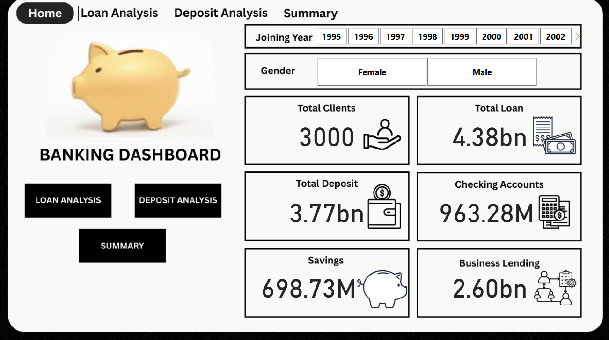
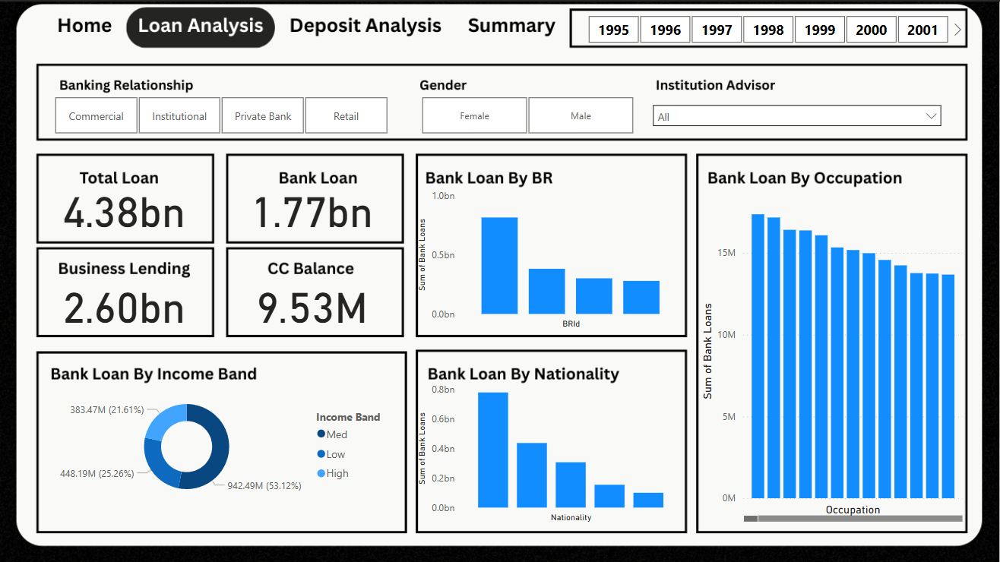
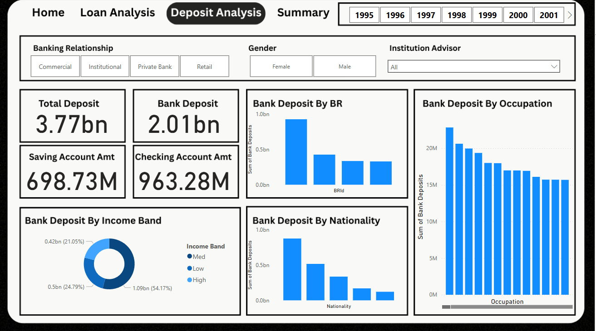
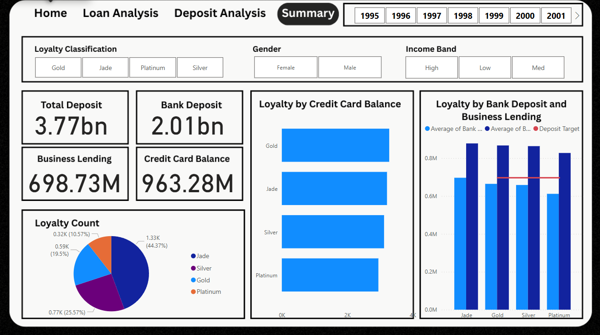

# Banking Preformance Analysis

## Background and Overview
GlobalTrust Bank is a mid-sized financial institution struggling to maximize profitability from its existing client base. Despite recording detailed transactional data (deposits, loans, loyalty tiers), the bank lacks a data-driven strategy to optimize cross-selling, risk management, and client retention.

This project analyzes 10+ key metrics—from loyalty tier profitability to deposit concentration risks—using SQL, Python, and Power BI. The goal is to uncover actionable insights to:

Boost revenue through targeted client monetization

Reduce risk by rebalancing loan/deposit portfolios

Improve retention by fixing loyalty program inefficiencies

Key Analysis Areas:

Loyalty Tier Performance (Revenue per tier, client engagement)

Deposit Trends (Geographic/demographic concentrations)

Loan Portfolio Health (Income-tier risk exposure)

[Download Power BI Dashboard][dashboard/bankingAnalysis.pdf] | [View Python]

---

## Executive Summary 

#Loyalty Program Inefficiencies
Gold Client Issues:
 -585 clients maintain $664K avg deposits (5% below Jade)
 -Yet carry highest credit balances ($3,281) - 16% above Jade
 -Potential to convert high-spenders into full-service clients

Platinum Tier Failure:
 -Low metrics across deposits ($611K), clients (317), and engagement
 -Performs below Silver tier ($658K deposits) despite "premium label"

#Deposit Findings: 
 - European clients hold 46% of deposits ($874M) and 2.6x more deposits than American clients ($874M vs $335M)
 - Over-reliance on one demographic increases vulnerability

#Loans Findings:
 - Middle-income borrowers dominate loans (53%) while high-income borrowers lag behind with 21%.
 - Economic downturns could disproportionately impact mid-tier borrowers
   
#Strategic Imperatives
 - Offer deposit incentives to convert Gold to Jade clients. This is to monetize their spending while growing deposits, other-wise Gold clients will be stuck in mid-tier profitability.
 - Rebuild or merge Platinum tier with Gold tier because it underperforms silver despite its premium label. Maintaining the underperforming Platinum label may drain company resources.
 - Target high income earners (engineers & doctors) because they only represent 21% of loans despite capacity for more. Relying on middle-income borrows (53% of loans) increases risk during recessions.

## Insights Deep Dive

#Loyalty Trends
- Gold and Jade Clients (78% and 79% of clients, respectively) have overleveraged loans (>1.5x their income) 
- Female clients show identical credit-to-deposit behavior across all tiers but Gold-tier women hold 54% less deposits than Jade tier women, yet their credit engagement per dollar deposited matches higher tiers.
- Gold-tier women are under-monetized as they use credit as much as Jade clients, but do not receive Jade tier benefits. 

#Loan Trends
- Top 3 Occupation by loans are Account Coordinators ($17.36M), Database Admins($17.16M), Office Assistants($16.41M) 
- Private Bank leads in Total Loans (1.99bn), Bank Loan (814.22M), Business Lending (1.17bn), and CC Balance (4.28M) compared to other sectors.
- Africans are amongst the least bank loan users by nationality.

#Deposit Analysis
 - Top 3 Occupation by Bank Deposit are Structural Analysis Engineer ($22.84M), Database Administrator ($20.6M), and Social Worker ($10.96M)
 - Senior Sales Associates are amongst the least occupation to bank deposit.

#Account Synergy
 - Bank deposits show strong positive correlations (r > 0.85) with: Checking Accounts, Saving Accounts, Foreign Currency Accounts.
 - This reveals High-value client behavior, as customers typically distribute accross multiple accounts instead of letting one account out grow the others. 

## Recommendations
1. Eliminate Platinum Tier
   - Merge Platinum into Gold and rebrand as "Gold Premier"
   - Redirect resources to enhance Jade-tier benefits.
   - Given that Platinum clients maintain 7% lower deposits than Silver-tier clients, the Platinum tier requires either a complete restructuring or elimination to reallocate resources toward higher-performing tiers.

2. Gold to Jade Conversion
   - Monetize Gold clients' credit card usage while upgrading them to higher-value Jade relationships.
   - Offer Jade incentives to gold clients with $3k+ avg monthly credit card spend <700k deposits (below Jade threshold)

3. Advertisements targeting Africa
   - Africans ranks last in both bank loan utilization ($100M) and deposits ($121M).
   - Target high population African cities
   - Offer a discount: 6% APY for first 10k
